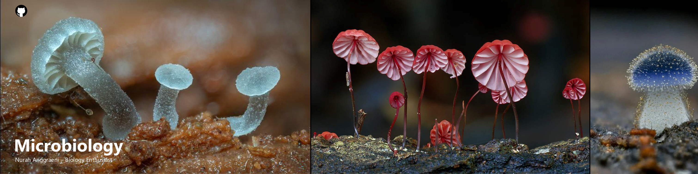

 

  
 
 Microorganisms, Microbial Genetics, Microbial Metabolism

**``This is about me``**
  I am an undergraduate student in the Biology Study Program, IPB University. And senior researcher at The IPB SSRS Association (Student Researcher Organization at IPB University).

### Interested and Skills in Progress
  

### Publication
- On Going..

________________________________________________________________________________________________________________________________________________________
**`Nurah Anggraeni`**
  _Department of Biology, Faculty of Mathematics and Natural Science, IPB University_
  _SSRS Fellow RO10 Biodiversity Research Group, IPB Sustainable Science Research Students Association (IPB SSRS Association), IPB University_
  _SSRS Indonesia Biodiversity Hub, SSRS Group_
  _SSRS Institute, SSRS Group_
  nurahanggraeni2710@gmail.com
  
